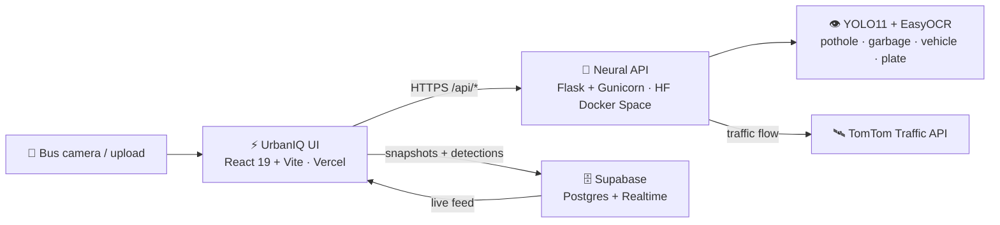

<div align="center">

# ⚡ URBAN**IQ** — CITY NERVOUS SYSTEM

### `SIH 26124` · AI-Powered Mobile Urban Intelligence Platform Using Public Transport Fleet

**Turn every city bus into a roaming sensor. Turn every frame into a decision.**

[](https://hyderabad-urban-intelligence.vercel.app)
[](https://priyaredddy-cse-hyderabad-urban-intelligence-api.hf.space/api/health)
[](https://react.dev)
[](https://vite.dev)

</div>

---

## 🛰️ What this is

Hyderabad has thousands of buses already driving every road, every day. UrbanIQ treats that
fleet as a **distributed sensor grid**: a phone or dash camera on board streams frames, YOLO
models read the road, and this dashboard turns raw pixels into civic action — potholes logged,
garbage flagged, vehicles counted, safe fitness routes recommended from live congestion.

No new hardware fleet. No new patrol crews. Just intelligence layered on top of transport that
is already moving.

## 🧠 Capabilities

| Module | What it does | Signal source |
| --- | --- | --- |
| 📊 **Dashboard** | City-wide vitals, congestion pulse, incident rollup | TomTom + YOLO |
| 🚌 **Live Fleet** | Bus roster, route status, live map | Fleet telemetry + Leaflet |
| 🕳️ **Pothole Detection** | Upload or capture a frame, get boxed potholes + confidence | YOLO `pothole2v.pt` |
| 🗑️ **Garbage Detection** | Flags waste hotspots and raises alerts | YOLO `best.pt` |
| 🚗 **Vehicle + Plate AI** | Counts vehicles, reads plates, scores rash motion | YOLO `yolo11n.pt` + EasyOCR |
| 🏃 **Fitness & Sports** | Walk / jog / cycle safety verdicts from live congestion, plus a realtime detection feed | TomTom + Supabase Realtime |
| 🚦 **Traffic Simulator** | Stress-test congestion scenarios before they happen | Congestion model |
| 🔔 **Alerts** | Chronological civic incident stream | Flask incident store |

## 🏗️ Architecture



**Why split?** YOLO weights and Torch will never fit a serverless function. The UI ships as
static assets on Vercel's edge; the heavy vision stack lives on a CPU Docker Space that can
hold models in memory. The two only ever speak JSON.

## 🚀 Quickstart

```bash
git clone https://github.com/karthikganjam99kg/urban-iq-frontend.git
cd urban-iq-frontend
npm install
cp .env.example .env.local     # add your Supabase + API values
npm run dev                    # http://localhost:5173
```

By default `npm run dev` proxies `/api` to `http://127.0.0.1:5001`, so you can run the backend
locally. Leave `VITE_API_BASE_URL` unset in development to use that proxy; production falls
back to the hosted Space automatically.

### Run the whole stack locally

```bash
# terminal 1 — neural API (port 5001, because macOS AirPlay squats on 5000)
pip install -r requirements.txt
echo "TOMTOM_API_KEY=your_key" > .env
gunicorn --bind 127.0.0.1:5001 --workers 1 --threads 2 --timeout 300 src.backend.app:app

# terminal 2 — command centre
npm run dev
```

## 🔑 Environment

| Variable | Where | Purpose |
| --- | --- | --- |
| `VITE_API_BASE_URL` | Vercel / `.env.local` | Neural API base URL, no trailing slash |
| `VITE_SUPABASE_URL` | Vercel / `.env.local` | Supabase project URL |
| `VITE_SUPABASE_PUBLISHABLE_KEY` | Vercel / `.env.local` | Browser-safe key, guarded by RLS |
| `TOMTOM_API_KEY` | **Backend only** | Billable traffic key — never expose in frontend |

Supabase is optional: without those two variables the app runs fine and simply hides the
history panel. With them, run [`supabase/schema.sql`](supabase/schema.sql) in the SQL editor to
create `traffic_snapshots` and `detections` with RLS and Realtime enabled.

## 🌐 Deploy

Every push to `main` ships to production via Vercel's Git integration.

```bash
git push origin main       # → build → https://hyderabad-urban-intelligence.vercel.app
```

The backend deploys separately — see the
[urban-iq-backend](https://github.com/karthikganjam99kg/urban-iq-backend) repo.

## 🗺️ Roadmap

- On-bus edge inference so only detections travel, not video
- Municipal work-order handoff for confirmed potholes
- Multi-city tenancy with per-corridor congestion baselines
- Historical heatmaps from the Supabase snapshot archive

<div align="center">

**Built for Smart India Hackathon · Problem Statement 26124**

</div>
